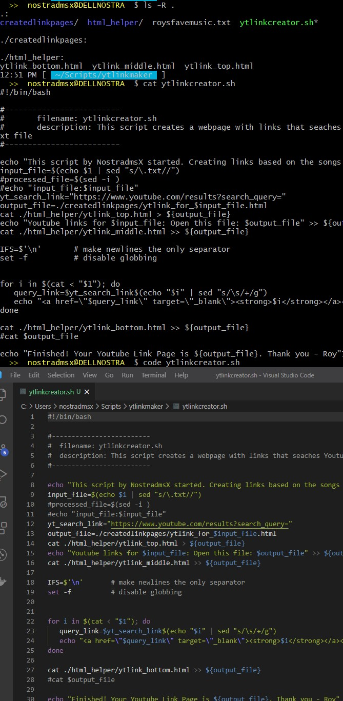
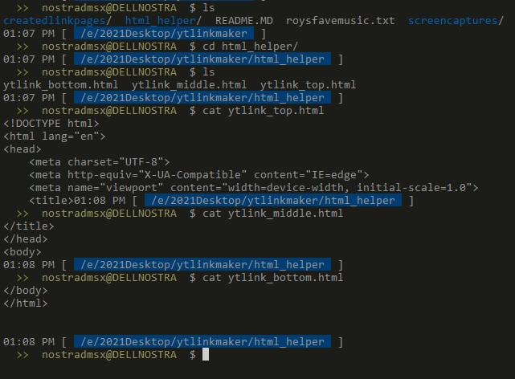
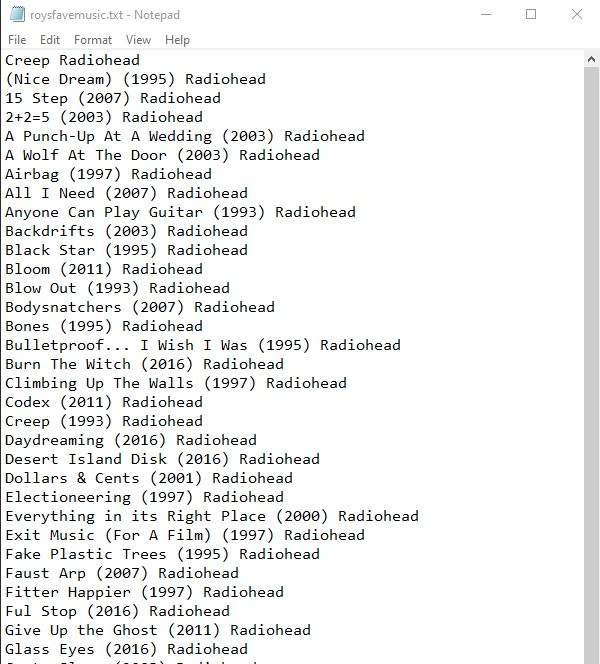
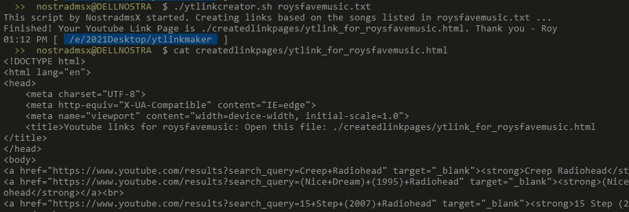
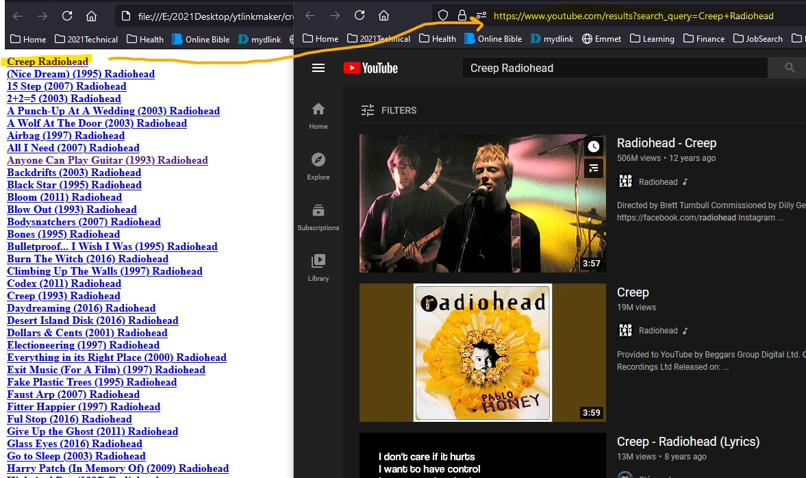

# YouTube Search Links Creator - A Bash Script

This script creates a webpage with links that search YouTube for songs listed in a specified text file. This is also a simple, yet practical exercise to advance my bash scripting skills. Feel free to fork, improve, comment, and suggest on how I can improve this script.

# The Bash Script Code:

Seen from Visual Code:

## HTML HELPER

To help create the output HTML page, I used these three files:  ytlink_top_html,  ytlink_middle.html  ytlink_bottom.html:

<!DOCTYPE html>

# Test Files:

A Test File Created Using Notepad in Windows 10

# Running the Script:

After running the script, we see the results:

## 	CLI Cmder

## 	Checking the Results on Windows 10

